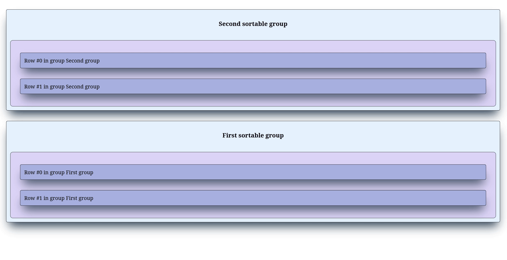

Because `SortableGroup` is a Dash component, it is possible to wrap it around a `SortableItem`, itself within a parent `SortableGroup`. This allows to have multiple levels of sortable lists, for instance sections or categories with sortable items inside that are themselves sortable.

The example below shows how this works:

=== "Dash layout"

    ```python
    import dash
    from   dash_sortable_items import SortableGroup, SortableItem

    app = dash.Dash(__name__, assets_folder='./')

    def generate_items(group_name: str) -> list[SortableItem]:

        out = []
        for i in range(2):

            out.append(
                SortableItem(
                    id        = f'{group_name}-item{i}', 
                    index     = i,
                    children  = [dash.html.Label(f'Row #{i} in group {group_name}')],
                    className = 'item'
                )
            )

        return out

    group1 = SortableItem(
        [
            dash.html.H3('First sortable group'),
            SortableGroup(
                id        = 'group1',
                children  = generate_items('First group'),
                className = 'group'
            )
        ],
        className = 'sortable-group',
        id        = 'group1-item',
        index     = 1
    )

    group2 = SortableItem(
        [
            dash.html.H3('Second sortable group'),
            SortableGroup(
                id        = 'group2',
                children  = generate_items('Second group'),
                className = 'group'
            )
        ],
        className = 'sortable-group',
        id        = 'group2-item',
        index     = 0
    )

    app.layout = SortableGroup([group1, group2])

    app.run(debug=True)
    ```

=== "CSS stylesheet"

    ```css
    .container {
        display          : flex;
        flex-direction   : column;
        background-color : #f4eeff;
        border           : 1px solid black;
        padding          : 10px;
        gap              : 20px;
    }

    .group {
        padding          : 30px !important;
        background-color : #dcd6f7;
        border           : 1px solid black;
        box-sizing       : border-box;
        width            : 100%;
    }

    .item {
        background-color : #a6b1e1 !important;
        box-shadow       : rgb(38, 57, 77) 0px 20px 30px -10px;
        transition       : all 0.2s ease-in-out;
    }

    .item:hover {
        background-color : #7e8cc5 !important;
        box-shadow       : rgb(38, 57, 77) 0px 20px 30px -10px;
        scale            : 1.01;
        transition       : all 0.2s ease-in-out;
    }

    .sortable-group {
        flex-direction   : column;
        background-color : #e4f1fe !important;
        box-shadow       : rgb(38, 57, 77) 0px 20px 30px -10px;
        transition       : all 0.2s ease-in-out;
    }

    .sortable-group:hover {
        box-shadow : rgb(38, 57, 77) 0px 20px 30px -10px;
        scale      : 1.01;
        transition : all 0.2s ease-in-out;
    }
    ```

=== "Example"

    { loading=lazy }

In the example above, we use `#!py3 generate_items()` to generate a list of sortable items with unique IDs and then create two groups `group1` and `group2`. For styling purposes, the groups are wrapped with a h3 HTML element to better identify the rows inside a `SortableItem`. Then, each `SortableItem` is placed inside a `SortableGroup`. This creates three `SortableGroup` components, one sitting at the top and acting as a group of groups and two inner groups that can be sorted. Each inner group also contains items that can be sorted within their parent group.

!!! important "Note:"
    As illustrated in the "Example" tab, at the moment items cannot be moved from one group to another.