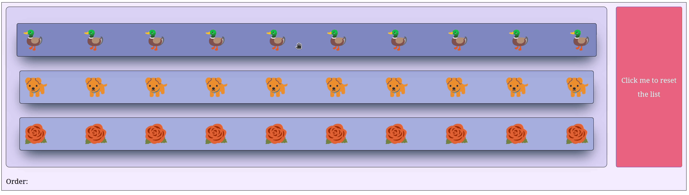

At the moment, there is no direct way to re-order items of a `SortableGroup` components via a callback. While it is possible to change the `sortedIds` props, this will not affect the interface.

The trick to re-order items programmatically is to wrap the `SortableGroup` within a parent element and draw again the `SortableGroup` child with its `SortableItem` children in a different order. In the example below, the `SortableGroup` component is wrapped within a Div HTML element with ID `group-container`. When the button is clicked, the `re_order` callback is called which creates a new `SortableGroup` component with the initial order for its children.

!!! note "Note:"
    Do not forget to also update the `sortedIds` props. Otherwise, the visible order will not match the internal order which may trigger glitches upon reordering.

=== "Dash layout"

    ```python hl_lines="70 71 72 73 74 75 76 77 78 79"
    import dash
    from   dash_iconify        import DashIconify
    from   dash_sortable_items import SortableGroup, SortableItem

    app = dash.Dash(__name__, assets_folder='./')

    def draw_items():

        item1 = SortableItem(
            id        = 'ducky',
            children  = [DashIconify(icon='noto:duck', width=50, height=50)]*10,
            className = 'item'
        )

        item2 = SortableItem(
            id        = 'doggo',
            children  = [DashIconify(icon='noto-v1:dog', width=50, height=50)]*10,
            className = 'item'
        )

        item3 = SortableItem(
            id        = 'rosie',
            children  = [DashIconify(icon='noto-v1:rose', width=50, height=50)]*10,
            className = 'item'
        )

        group = SortableGroup(
            id        = 'group',
            items     = [item1, item2, item3],
            className = 'group'
        )

        return group

    group           = draw_items()
    group_container = dash.html.Div(group, id='group-container', className='group-container')

    button = dash.dcc.Button(
        'Click me to reset the list',
        style     = {'maxWidth' : '150px'},
        id        = 'button',
        className = 'button'
    )

    label = dash.html.Label('Order:', id='label')

    app.layout = dash.html.Div([
            dash.html.Div(
                [group_container, button], 
                style = {
                    'display'       : 'flex', 
                    'flexDirection' : 'row',
                    'gap'           : '20px'
            }), 
            label
        ], 
        className='container'
    )

    @app.callback(
        dash.Output('label', 'children'),
        dash.Input('group', 'sortedIds')
    )
    def _(sortedIds: list[str] | None) -> str: 

        if sortedIds is None: raise dash.exceptions.PreventUpdate

        return '/'.join(sortedIds)

    @app.callback(
        dash.Output('group-container', 'children'),
        dash.Output('group', 'sortedIds'),
        dash.Input('button', 'n_clicks')
    )
    def re_order(_) -> tuple[SortableGroup, list[str]]:

        if _ is None: raise dash.exceptions.PreventUpdate

        return draw_items(), ['ducky', 'doggo', 'rosie']

    app.run(debug=True)
    ```

=== "CSS stylesheet"

    ```css
    .container {
        display          : flex;
        flex-direction   : column;
        background-color : #f4eeff;
        border           : 1px solid black;
        padding          : 10px;
        gap              : 20px;
    }

    .group-container {
        width: 100%;
    }

    .group {
        padding          : 30px !important;
        background-color : #dcd6f7;
        border           : 1px solid black;
    }

    .item {
        background-color : #a6b1e1 !important;
        box-shadow       : rgb(38, 57, 77) 0px 20px 30px -10px;
        transition       : all 0.2s ease-in-out;
        justify-content  : space-between;
    }

    .item:hover {
        background-color : #7e8cc5 !important;
        box-shadow       : rgb(38, 57, 77) 0px 20px 30px -10px;
        scale            : 1.01;
        transition       : all 0.2s ease-in-out;
    }

    .button {
        background-color: #f67280;
        color: white;
        transition       : all 0.2s ease-in-out;
    }

    .button:hover {
        background-color: #f67280;
        box-shadow       : #c06c84 0px 20px 30px -10px;
        color            : white;
        scale            : 1.01;
        transition       : all 0.2s ease-in-out;
    }

    .button:active {
        background-color: #f67280;
        color            : white;
        scale            : 0.99;
        transition       : all 0.2s ease-in-out;
    }
    ```

=== "Example"

    { loading=lazy }