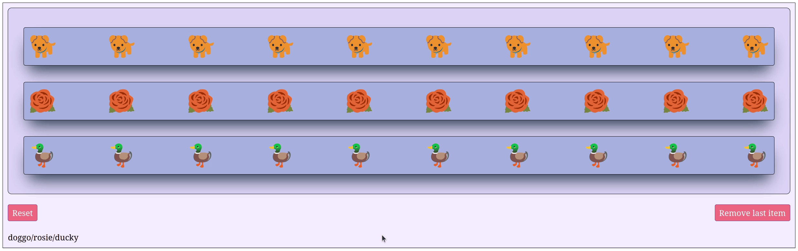

Adding or removing the items from a [`SortableGroup`](../API/sortable_group.md) or updating the order of the items can be done via callbacks by passing the `children` props as output. Thus, this requires to redraw the [`SortableItem`](../API/sortable_item.md) children. Note that the `sortedIds` props is automatically updated when the children change.

!!! note "Note:"
    Updating `sortedIds` in a callback will not draw again the chidren in a different order

The `children` props is not sorted. To get the right child in a callback based on its position, use `sortedIds` in combination with `children` (see the example below).

=== "Dash layout"

    ```python hl_lines="83 84 85 86 87 88 89 90 91 92 94 95 96 97 98 99 100 101 102 103 104 105 106 107 108 109 110 111 112 113 114 115 116 117"
    import dash
    from   dash_iconify        import DashIconify
    from   dash_sortable_items import SortableGroup, SortableItem

    app = dash.Dash(__name__, assets_folder='./')

    def draw_items() -> list[SortableItem]:

        item1 = SortableItem(
            id        = 'ducky',
            children  = [DashIconify(icon='noto:duck', width=50, height=50)]*10,
            className = 'item'
        )

        item2 = SortableItem(
            id        = 'doggo',
            children  = [DashIconify(icon='noto-v1:dog', width=50, height=50)]*10,
            className = 'item'
        )

        item3 = SortableItem(
            id        = 'rosie',
            children  = [DashIconify(icon='noto-v1:rose', width=50, height=50)]*10,
            className = 'item'
        )

        return [item1, item2, item3]

    group = SortableGroup(
        id        = 'group',
        children  = draw_items(),
        className = 'group'
    )

    group_container = dash.html.Div(group, id='group-container', className='group-container')

    button1 = dash.dcc.Button(
        'Reset',
        id        = 'button1',
        className = 'button'
    )

    button2 = dash.dcc.Button(
        'Remove last item',
        id        = 'button2',
        className = 'button'
    )

    button_row = dash.html.Div(
        [button1, button2],
        style = {
            'display'        : 'flex', 
            'flexDirection'  : 'row',
            'justifyContent' : 'space-between'
        }
    )

    label = dash.html.Label('Order:', id='label')

    app.layout = dash.html.Div([
            dash.html.Div(
                [group_container, button_row], 
                style = {
                    'display'       : 'flex',   
                    'flexDirection' : 'column',
                    'gap'           : '20px'
            }), 
            label
        ], 
        className='container')

    @app.callback(
        dash.Output('label', 'children'),
        dash.Input('group', 'sortedIds')
    )
    def _(sortedIds: list[str] | None) -> str: 
        r'''Update the label every time the sortedIds props changes.'''

        if sortedIds is None: raise dash.exceptions.PreventUpdate

        return '/'.join(sortedIds)

    @app.callback(
        dash.Output('group', 'children'),
        dash.Input('button1', 'n_clicks')
    )
    def reset(_) -> list[SortableItem]:
        r'''Reset the list when button1 is clicked.'''

        if _ is None: raise dash.exceptions.PreventUpdate

        return draw_items()

    @app.callback(
        dash.Output('group', 'children', allow_duplicate=True),
        dash.Input('button2', 'n_clicks'),
        dash.State('group', 'children'),
        dash.State('group', 'sortedIds'),
        prevent_initial_call = True
    )
    def remove1(_, children: list[SortableItem], sortedIds: list[str]) -> list[SortableItem]:
        r'''Remove one element in the list whenever button2 is clicked.'''

        if _ is None: raise dash.exceptions.PreventUpdate

        last_id = sortedIds[-1]

        # Extract the ids of the chidlren of the group
        children_ids = [child['props']['id'] for child in children]

        # Find and remove the child with the last id in sortedId
        if last_id in children_ids:
            children.pop(children_ids.index(last_id))
        else: 
            children = []

        return children

        app.run(debug=True)
    ```

=== "CSS stylesheet"

    ```css
    .container {
        display          : flex;
        flex-direction   : column;
        background-color : #f4eeff;
        border           : 1px solid black;
        padding          : 10px;
        gap              : 20px;
    }

    .group-container {
        width: 100%;
    }

    .group {
        padding          : 30px !important;
        background-color : #dcd6f7;
        border           : 1px solid black;
    }

    .item {
        background-color : #a6b1e1 !important;
        box-shadow       : rgb(38, 57, 77) 0px 20px 30px -10px;
        transition       : all 0.2s ease-in-out;
        justify-content  : space-between;
    }

    .item:hover {
        background-color : #7e8cc5 !important;
        box-shadow       : rgb(38, 57, 77) 0px 20px 30px -10px;
        scale            : 1.01;
        transition       : all 0.2s ease-in-out;
    }

    .button {
        background-color: #f67280;
        color: white;
        transition       : all 0.2s ease-in-out;
    }

    .button:hover {
        background-color: #f67280;
        box-shadow       : #c06c84 0px 20px 30px -10px;
        color            : white;
        scale            : 1.01;
        transition       : all 0.2s ease-in-out;
    }

    .button:active {
        background-color: #f67280;
        color            : white;
        scale            : 0.99;
        transition       : all 0.2s ease-in-out;
    }
    ```

=== "Example"

    { loading=lazy }