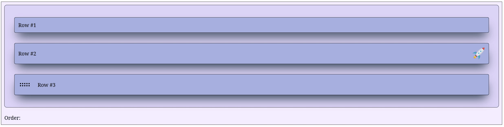

Instead of having the entire row draggable, it is possible to provide to `SortableItem` a drag handle with `#!py3 handle = ...` followed by a Dash component that will be used as the handle. Usually, one uses an icon which can be provided by [Dash iconify](https://pypi.org/project/dash-iconify/) but any Dash component works.

The handle can be positioned at the beginning of the div parent element with `#!py3 handle = 'start'` or at the end with `#!py3 handle = 'end'`.

To customize the div parent element and/or the handle, one can provide to `SortableItem` a dictionary with `#!py3 styles = ...` containing two optional dictionaries with CSS stylesheet properties as key-value pairs:

- one named `#!py3 'div'` which styles the div parent element
- another one named `#!py3 'handle'` which styles specifically the handle

For instance, in the example below, the div parent element is styled with `#!py3 'div' : {'display' : 'flex', 'justifyContent' : 'space-between' }` but the handle is left as is.

=== "Dash layout"

    ```python hl_lines="15 16 26 27 19 20 21"
    import dash
    from   dash_sortable_items import SortableGroup, SortableItem
    from   dash_iconify        import DashIconify

    app = dash.Dash(__name__, assets_folder='./')

    item1 = SortableItem(
        id        = 'item1',
        children  = [dash.html.Label('Row #1')],
        className = 'item'
    )

    item2 = SortableItem(
        id        = 'item2',
        handle    = DashIconify(icon='emojione:rocket', width=40, height=40),
        handlePos = 'end',
        children  = [dash.html.Label('Row #2')],
        className = 'item',
        styles    = {
            'div' : {'display' : 'flex', 'justifyContent' : 'space-between' }
        }
    )

    item3 = SortableItem(
        id        = 'item3',
        handle    = DashIconify(icon='mdi:drag-horizontal', width=40, height=40),
        handlePos = 'start',
        children  = [dash.html.Label('Row #3')],
        className = 'item'
    )

    group = SortableGroup(
        id        = 'group',
        items     = [item1, item2, item3],
        className = 'group'
    )

    label = dash.html.Label('Order:', id='label')

    app.layout = dash.html.Div([group, label], className='container')

    @app.callback(
        dash.Output('label', 'children'),
        dash.Input('group', 'sortedIds')
    )
    def _(sortedIDs: list | None) -> str:

        if sortedIDs is None: raise dash.exceptions.PreventUpdate
        return f'Order: {sortedIDs}'

    app.run(debug=True)
    ```

=== "CSS stylesheet"

    ```css
    .container {
        display          : flex;
        flex-direction   : column;
        background-color : #f4eeff;
        border           : 1px solid black;
        padding          : 10px;
        gap              : 20px;
    }

    .group {
        padding          : 30px !important;
        background-color : #dcd6f7;
        border           : 1px solid black;
    }

    .item {
        background-color : #a6b1e1 !important;
        box-shadow       : rgb(38, 57, 77) 0px 20px 30px -10px;
        transition       : all 0.2s ease-in-out;
    }

    .item:hover {
        background-color : #7e8cc5 !important;
        box-shadow       : rgb(38, 57, 77) 0px 20px 30px -10px;
        scale            : 1.01;
        transition       : all 0.2s ease-in-out;
    }
    ```

=== "Example"

    { loading=lazy }