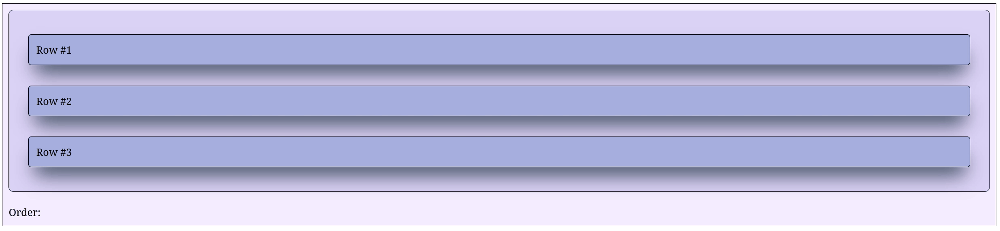

It is possible to lock an item to prevent it from being draggable by providing `#!py3 lock = True` to `SortableGroup`.

See the example below for a layout with the first item locked.

=== "Dash layout"

    ```python hl_lines="8"
    import dash
    from   dash_sortable_items import SortableGroup, SortableItem

    app = dash.Dash(__name__, assets_folder='./')

    item1 = SortableItem(
        id        = 'item1',
        lock      = True,
        children  = [dash.html.Label('Row #1')],
        className = 'item'
    )

    item2 = SortableItem(
        id        = 'item2',
        children  = [dash.html.Label('Row #2')],
        className = 'item'
    )

    item3 = SortableItem(
        id        = 'item3',
        children  = [dash.html.Label('Row #3')],
        className = 'item'
    )

    group = SortableGroup(
        id        = 'group',
        items     = [item1, item2, item3],
        className = 'group'
    )

    label = dash.html.Label('Order:', id='label')

    app.layout = dash.html.Div([group, label], className='container')

    @app.callback(
        dash.Output('label', 'children'),
        dash.Input('group', 'sortedIds')
    )
    def _(sortedIDs: list | None) -> str:

        if sortedIDs is None: raise dash.exceptions.PreventUpdate
        return f'Order: {sortedIDs}'

    app.run(debug=True)
    ```

=== "CSS stylesheet"

    ```css
    .container {
        display          : flex;
        flex-direction   : column;
        background-color : #f4eeff;
        border           : 1px solid black;
        padding          : 10px;
        gap              : 20px;
    }

    .group {
        padding          : 30px !important;
        background-color : #dcd6f7;
        border           : 1px solid black;
    }

    .item {
        background-color : #a6b1e1 !important;
        box-shadow       : rgb(38, 57, 77) 0px 20px 30px -10px;
        transition       : all 0.2s ease-in-out;
    }

    .item:hover {
        background-color : #7e8cc5 !important;
        box-shadow       : rgb(38, 57, 77) 0px 20px 30px -10px;
        scale            : 1.01;
        transition       : all 0.2s ease-in-out;
    }
    ```

=== "Example"

    { loading=lazy }